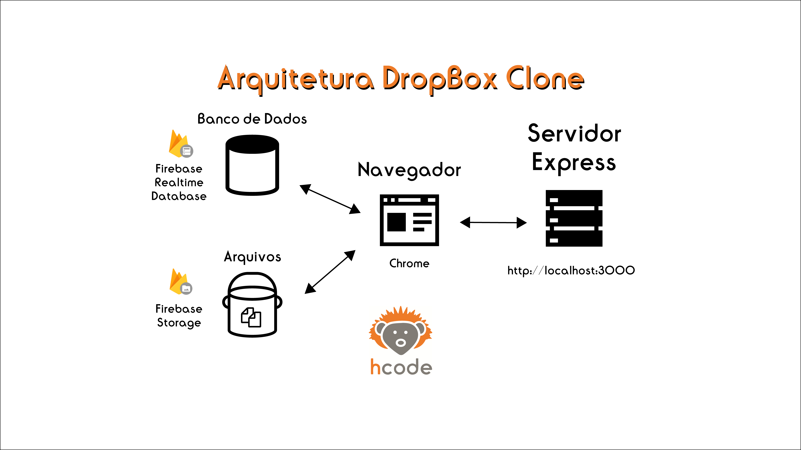
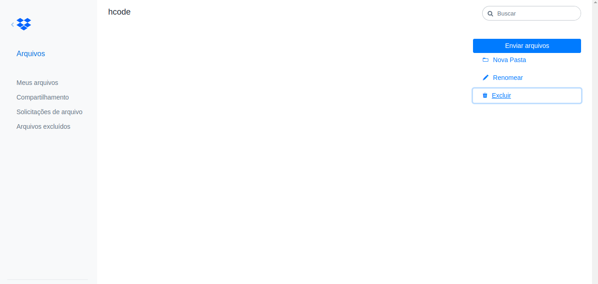
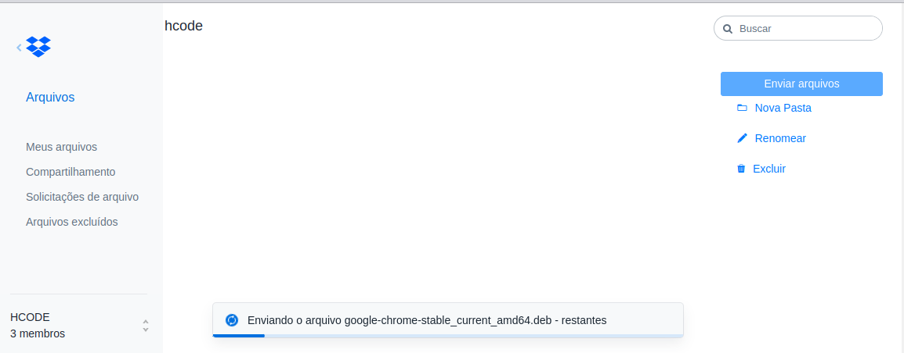

## 💻 HCODE - DropBox

Este repósitorio contém todo o codigo fonte utilizado para construir um clone, da plataforma DropBox

### 🚀 Layout

-  Arquitetura do projeto

 

-  Tela principal

 

-  Modal de carregamento

 

### 🚀 Techs

- HTML
- CSS
- JavaScript
- NodeJS
- Firabase
- Bower

### 🚀 Start of project

- bower install
- npm install
- npm start
- Less GO 

### ✅ Construindo o projeto

- [x] Instalando dependências para Front-End do Bower
- [x] Criando rotas 
- [x] Melhorando a leitura e envio de dados
- [x] Salvando dados no Firabse e armazenando no servidor local
- [x] Posteriormente, salvando os arquivos no storage da Firabase
- [x] Done

Feito por @Andrey Dario 👋 Contato no Linkedin [de portas abertas](https://www.linkedin.com/in/andreydario/)!